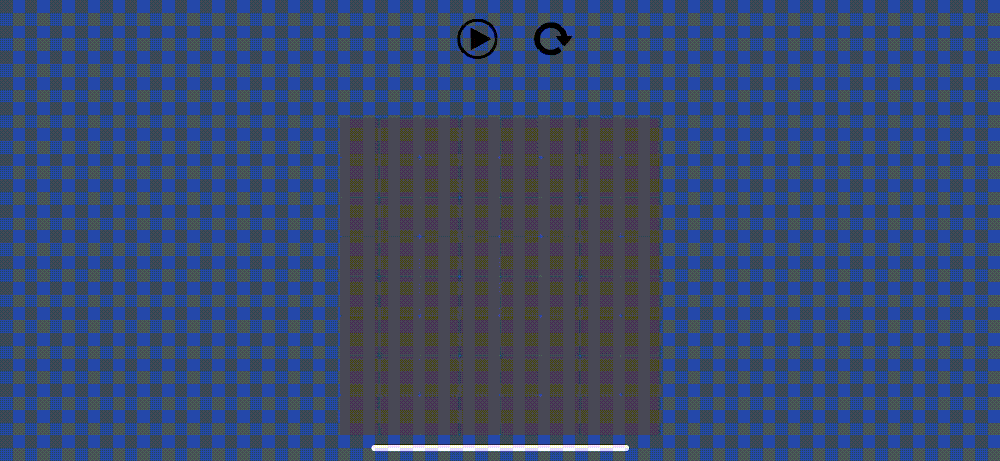

# MusicBoard
Unity2D Sample Music Board project.

Sample Unity(version 2020) app, allowing to select cell in the grid being constructed in the code with playing sample music. Simple UI has play/pause & restart button, handles input touches on mobile. 
On iOS configured to be displayed in landscape mode. Cell Prefab is based on Sprite usage.

